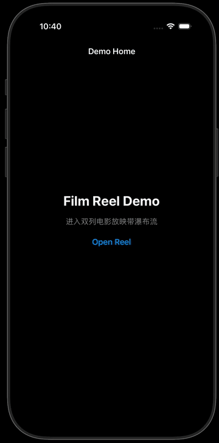

# FilmReelDemoApp

iOS 16 UIKit demo of a dual-column "film reel" waterfall feed. The two columns auto-scroll in opposite directions on launch, then seamlessly switch to unified scrolling on touch or after a 3-second countdown.

## Features

- UICollectionView + custom masonry layout (strong reuse)
- Reel mode with opposing column offsets
- Unified mode with no visible jump on transition
- Configurable reel speed, countdown, and offset range

## Requirements
- Xcode 15+
- iOS 16+

## Run

1. Open `FilmReelDemoApp.xcodeproj` in Xcode.
2. Select the `FilmReelDemoApp` scheme.
3. Run on an iOS 16+ simulator or device.

## Demo

Full video: [`screen_recording.mp4`](./screen_recording.mp4)

## Configuration
Tune parameters in `FilmReelDemoApp/FilmReelDemoApp/FilmReelDemo/ReelConfig.swift`.

## License
MIT. See `LICENSE`.
